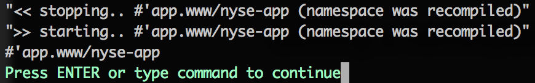
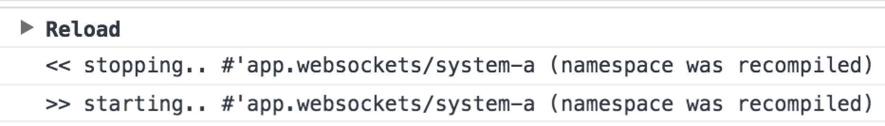

> I think that it's _extraordinarily important_ that we in computer science keep fun in computing

_**Alan J. Perlis** from [Structure and Interpretation of Computer Programs](https://mitpress.mit.edu/sites/default/files/sicp/full-text/book/book-Z-H-3.html)_

# mount 
[](https://travis-ci.org/tolitius/mount)
[](https://github.com/tolitius/mount/releases)
[](https://clojars.org/mount)

###### _any_ questions or feedback: [`#mount`](https://clojurians.slack.com/messages/mount/) clojurians slack channel  (or just [open an issue](https://github.com/tolitius/mount/issues))

**Table of Contents**  *generated with [DocToc](https://github.com/thlorenz/doctoc)*

- [Why?](#why)
  - [Differences from Component](#differences-from-component)
- [How](#how)
  - [Creating State](#creating-state)
  - [Using State](#using-state)
- [Dependencies](#dependencies)
  - [Talking States](#talking-states)
- [Value of Values](#value-of-values)
- [The Importance of Being Reloadable](#the-importance-of-being-reloadable)
- [Start and Stop Order](#start-and-stop-order)
- [Composing States](#composing-states)
- [Start and Stop Parts of Application](#start-and-stop-parts-of-application)
- [Start an Application Without Certain States](#start-an-application-without-certain-states)
- [Swapping Alternate Implementations](#swapping-alternate-implementations)
  - [Swapping States with Values](#swapping-states-with-values)
  - [Swapping States with States](#swapping-states-with-states)
- [Stop an Application Except Certain States](#stop-an-application-except-certain-states)
- [ClojureScript is Clojure](doc/clojurescript.md#managing-state-in-clojurescript)
- [cljc mode](#cljc-mode)
  - [Disable Lazy Start](#disable-lazy-start)
- [Packaging](#packaging)
- [Affected States](#affected-states)
- [Recompiling Namespaces with Running States](#recompiling-namespaces-with-running-states)
  - [:on-reload](#on-reload)
- [Cleaning up Deleted States](#cleaning-up-deleted-states)
- [Logging](#logging)
  - [mount-up](#mount-up)
  - [Manual AOP](#manual-aop)
- [Exception Handling](#exception-handling)
- [Clojure Version](#clojure-version)
- [Mount and Develop!](#mount-and-develop)
  - [Running New York Stock Exchange](#running-new-york-stock-exchange)
  - [New York Stock Exchange Maintenance](#new-york-stock-exchange-maintenance)
- [Web and Uberjar](#web-and-uberjar)
- [Runtime Arguments](#runtime-arguments)
- [License](#license)

<!-- END doctoc generated TOC please keep comment here to allow auto update -->

## Why?

Clojure is

* powerful
* simple
* and _fun_

Depending on how application state is managed during development, the above three superpowers can either stay,
go somewhat, or go completely.

If Clojure REPL (i.e. `lein repl`, `boot repl`) fired up instantly, the need to reload application state
inside the REPL would go away. But at the moment, and for some time in the future, managing state by making it
reloadable within the same REPL session is important to retain all the Clojure superpowers.

Here is a good [breakdown](http://blog.ndk.io/clojure-bootstrapping.html) on the Clojure REPL
startup time, and it is [not because of JVM](http://blog.ndk.io/jvm-slow-startup.html).

`mount` is here to preserve all the Clojure superpowers while making _the application state_ enjoyably reloadable.

There is another Clojure superpower that `mount` is made to retain: Clojure community.
Pull request away, let's solve this thing!

### Differences from Component

`mount` is an alternative to the [component](https://github.com/stuartsierra/component) approach with notable [differences](doc/differences-from-component.md#differences-from-component).

## How

```clojure
(require '[mount.core :refer [defstate]])
```

### Creating State

Creating state is easy:

```clojure
(defstate conn :start (create-conn))
```

where the `create-conn` function creates a connection (for example to a database) and is defined elsewhere, can be right above it.

In case this state needs to be cleaned / destroyed between reloads, there is also `:stop`

```clojure
(defstate conn :start (create-conn)
               :stop (disconnect conn))
```

That is pretty much it. But wait, there is more.. this state is _a top level being_, which means it can be simply
`required` by other namespaces or in REPL:

```clojure
dev=> (require '[app.nyse :refer [conn]])
nil
dev=> conn
#object[datomic.peer.LocalConnection 0x1661a4eb "datomic.peer.LocalConnection@1661a4eb"]
```

### Using State

For example let's say an `app` needs a connection above. No problem:

```clojure
(ns app
  (:require [above :refer [conn]]))
```

where `above` is an arbitrary namespace that defines the above state / connection.

### Documentation String

As in any definition (i.e. `def`, `defn`) a documentation string can be added to better describe a state:

```clojure
(defstate answer
  "answer to the ultimate question of life universe and everything"
  :start (+ 1 41))
```
```clojure
(doc answer)
-------------------------
dev/answer
  answer to the ultimate question of life universe and everything
```

## Dependencies

If the whole app is one big application context (or `system`), cross dependencies with a solid dependency graph
is an integral part of the system.

But if a state is a simple top level being, these beings can coexist with each other and with other
namespaces by being `required` instead.

If a managing state library requires a whole app buy-in, where everything is a bean or a component,
it is a framework, and  dependency graph is usually quite large and complex,
since it has _everything_ (every piece of the application) in it.

But if stateful things are kept lean and low level (i.e. I/O, queues, threads, connections, etc.), dependency graphs are simple and small, and everything else is just namespaces and functions: the way it should be.

### Talking States

There are of course direct dependencies that `mount` respects:

```clojure
(ns app.config
  (:require [mount.core :refer [defstate]]))

(defstate config
  :start (load-config "test/resources/config.edn"))
```

this `config`, being top level, can be used in other namespaces, including the ones that create states:

```clojure
(ns app.database
  (:require [mount.core :refer [defstate]]
            [app.config :refer [config]]))

(defstate conn :start (create-connection config))
```

[here](dev/clj/app/www.clj#L32) is an example of a web server that "depends" on a similar `config`.

###### _(the example `load-config` function above comes from [cprop](https://github.com/tolitius/cprop), but could of course be a custom function that loads configuration from a file)_

## Value of values

Lifecycle functions start/stop can take both functions and values. This is "valuable" and also works:

```clojure
(defstate answer-to-the-ultimate-question-of-life-the-universe-and-everything :start 42)
```

While it would be useful in REPL and for testing, real application states would usually have start / stop logic, in other words, the real lifecycle.

Besides scalar values, lifecycle functions can take anonymous functions, partial functions, function references, etc.. Here are some examples:

```clojure
(defn f [n]
  (fn [m]
    (+ n m)))

(defn g [a b]
  (+ a b))

(defn- pf [n]
  (+ 41 n))

(defn fna []
  42)

(defstate scalar :start 42)
(defstate fun :start #(inc 41))
(defstate with-fun :start (inc 41))
(defstate with-partial :start (partial g 41))
(defstate f-in-f :start (f 41))
(defstate f-no-args-value :start (fna))
(defstate f-no-args :start fna)
(defstate f-args :start g)
(defstate f-value :start (g 41 1))
(defstate private-f :start pf)
```

Check out [fun-with-values-test](test/core/mount/test/fun_with_values.cljc) for more details.

## The Importance of Being Reloadable

`mount` has start and stop functions that will walk all the states created with `defstate` and start / stop them
accordingly: i.e. will call their `:start` and `:stop` defined functions. Hence the whole application state can be reloaded in REPL e.g.:

```
dev=> (require '[mount.core :as mount])

dev=> (mount/stop)
dev=> (mount/start)
```

While it is not always necessary, mount lifecycle can be easily hooked up to [tools.namespace](https://github.com/clojure/tools.namespace),
to make the whole application reloadable with refreshing the app namespaces.
Here is a [dev.clj](dev/clj/dev.clj) as an example, that sums up to:

```clojure
(defn go []
  (start)
  :ready)

(defn reset []
  (stop)
  (tn/refresh :after 'dev/go))
```

the `(reset)` is then used in REPL to restart / reload application state without the need to restart the REPL itself.

## Start and Stop Order

Since dependencies are "injected" by `require`ing on the namespace level, `mount` **trusts the Clojure compiler** to
maintain the start and stop order for all the `defstates`.

The "start" order is then recorded and replayed on each `(reset)`.

The "stop" order is simply `(reverse "start order")`:

```clojure
dev=> (reset)
08:21:39.430 [nREPL-worker-1] DEBUG mount - << stopping..  nrepl
08:21:39.431 [nREPL-worker-1] DEBUG mount - << stopping..  conn
08:21:39.432 [nREPL-worker-1] DEBUG mount - << stopping..  config

:reloading (app.config app.nyse app.utils.datomic app)

08:21:39.462 [nREPL-worker-1] DEBUG mount - >> starting..  config
08:21:39.463 [nREPL-worker-1] DEBUG mount - >> starting..  conn
08:21:39.481 [nREPL-worker-1] DEBUG mount - >> starting..  nrepl
:ready
```

You can see examples of start and stop flows in the [example app](README.md#mount-and-develop).

## Composing States

Besides calling `(mount/start)` there are other useful ways to start an application:

* [starting parts of an application](README.md#start-and-stop-parts-of-application)
* [starting an application without certain states](README.md#start-an-application-without-certain-states)
* [swapping alternate implementations](README.md#swapping-alternate-implementations)
* [passing runtime arguments](README.md#runtime-arguments)

While all of these are great by themselves, sometimes it is really handy to compose these super powers. For example to start an application with _only_ certain states, _swapping_ a couple of them for new values, while passing runtime _arguments_.

### Composer's Toolbox

Each "tool" has a single responsibility and can be composed with other tools in _any_ combination and order.

* `only` will return _only_ states that it is given + exist (seen by mount) in the application
* `except` will return all the states that it is given _except_ a given set
* `swap` will take a map with keys as states and values as their substitute values
* `swap-states` will take a map with keys as states and values with `{:start fn :stop fn}` as their substitute states
* `with-args` will take a map that could later be accessed by `(mount/args)`

All these functions take one or two arguments. If called with two arguments, the first one will be treated as the universe of states to work with. If called with one argument, it will work with _all known_ to mount states.

None of these functions start or stop the application states, they merely serve as transformations from the initial set of states to the one that will later be passed to `(mount/start)`.

### Be Composing

All of the above is much easier to understand by looking at examples:

```clojure
(-> (only #{#'foo/a
            #'foo/b
            #'foo/c
            #'bar/d
            #'baz/e})
    (except [#'foo/c
             #'bar/d])
    (with-args {:a 42})
    mount/start)
```

This would start off from 5 states, even though the whole application may have many more states available. It would then exclude two states (i.e. `#'foo/c` and `#'bar/d`), then it will pass runtime arguments `{:a 42}`, and finally it will start the remaining three states: `#'foo/a`, `#'foo/b`, `#'baz/e`.

You may notice that `only` takes a set, while `except` takes a vector in this example. This is done intentionally to demonstrate that both these functions can take any collection of states. `set` would make more sense for most cases though.

Here is a more "involved" example:

```clojure
(-> (only #{#'foo/a
            #'foo/b
            #'foo/c
            #'bar/d
            #'baz/e})
    (with-args {:a 42})
    (except [#'foo/c
             #'bar/d])
    (swap-states {#'foo/a {:start #(create-connection test-conf)
                           :stop #(disconnect a)}})
    (swap {#'baz/e {:datomic {:uri "datomic:mem://composable-mount"}}})
    mount/start)
```

This will do the same thing as the previous example plus it would swap `#'foo/a` with alternative `:start` and `:stop` functions and `#'baz/e` with `{:datomic {:uri "datomic:mem://composable-mount"}}` value before starting the application.

## Start and Stop Parts of Application

In REPL or during testing it is often very useful to work with / start / stop _only a part_ of an application, i.e. "only these two states".

`mount`'s lifecycle functions, i.e. start/stop, can _optionally_ take states as vars (i.e. prefixed with their namespaces):

```clojure
(mount/start #'app.config/config #'app.nyse/conn)
...
(mount/stop #'app.config/config #'app.nyse/conn)
```

which will _only_ start/stop `config` and `conn` (won't start/stop any other states).

Here is an [example](test/core/mount/test/parts.cljc) test that uses only two namespaces checking that the third one is not started.

## Start an Application Without Certain States

Whether it is in REPL or during testing, it is often useful to start an application _without_ certain states. These can be queue listeners that are not needed at REPL time, or a subset of an application to test.

The `start-without` function can do just that:

```clojure
(mount/start-without #'app.feeds/feed-listener
                     #'app/nrepl)
```

which will start an application without starting `feed-listener` and `nrepl` states.

Here is an [example](test/core/mount/test/start_without.cljc) test that excludes Datomic connection and nREPL from an application on start.

## Swapping Alternate Implementations

During testing it is often very useful to mock/stub certain states. For example running a test against an in memory database vs. the real one, running with a publisher that publishes to a test core.async channel vs. the real remote queue, etc.

### Swapping States with Values

The `start-with` function takes values as substitutes.

Say we have a `send-sms` state:

```clojure
(ns app.sms)
;; ...
(defstate send-sms :start (create-sms-sender
                            (:sms config)))
```

When running tests it would be great _not_ to send the real text messages, but rather send them all to a local core.async channel instead:

```clojure
(let [sms-ch (chan)
      send-sms (fn [sms] (go (>! sms-ch sms)))]
  (mount/start-with {#'app.sms/send-sms send-sms})   ;; <<<< swapping the "send-sms" state with a test function
  ;; testing.. checking "sms-ch" channel
  (mount/stop))
```

`start-with` takes a map of states with their substitutes. For example `#'app.sms/send-sms` here is the real deal SMS sender that is being substituted with a `send-sms` test function.

### Swapping States with States

The `start-with-states` function takes values in a form of `{:start fn :stop fn}` as substitutes:

```clojure
(mount/start-with-states {#'app.neo/db        {:start #(connect test-config)
                                               :stop #(disconnect db)}
                          #'app.neo/publisher {:start #(create-pub test-config)
                                               :stop #(close-pub publisher)}})
```

`start-with-states` takes a map of states with their substitutes. For example `#'app.nyse/db` here is the real deal (remote) DB that is being
substituted with `#(connect test-config)` function, which could endup being anything, a map, an in memory DB, etc.

The `:stop` functions of substitutes can be anything, and could refer to the original state references. As in the example above: `db` and `publisher`
are real references. They would need to be accessible from the namespace of course, so you might need to `(:require [app.neo :refer [db]])`
in order to use `db` in `:stop #(disconnect db)` example above.

--

One thing to note is whenever

```clojure
(mount/stop)
```

is run after `start-with`/`start-with-states`, it rolls back to an original "state of states", i.e. `#'app.neo/db` is `#'app.neo/db` again. So subsequent calls to `(mount/start)` or even to `(mount/start-with {something else})` will start from a clean slate.

Here is an [example](test/core/mount/test/start_with_states.cljc) test that starts an app with mocking Datomic connection and nREPL.

## Stop an Application Except Certain States

Calling `(mount/stop)` will stop all the application states. In case everything needs to be stopped _besides certain ones_, it can be done with `(mount/stop-except)`.

Here is an example of restarting the application without bringing down `#'app.www/nyse-app`:

```clojure
dev=> (mount/start)
14:34:10.813 [nREPL-worker-0] INFO  mount.core - >> starting..  config
14:34:10.814 [nREPL-worker-0] INFO  mount.core - >> starting..  conn
14:34:10.814 [nREPL-worker-0] INFO  app.db - creating a connection to datomic: datomic:mem://mount
14:34:10.838 [nREPL-worker-0] INFO  mount.core - >> starting..  nyse-app
14:34:10.843 [nREPL-worker-0] DEBUG o.e.j.u.component.AbstractLifeCycle - STARTED SelectChannelConnector@0.0.0.0:4242
14:34:10.843 [nREPL-worker-0] DEBUG o.e.j.u.component.AbstractLifeCycle - STARTED org.eclipse.jetty.server.Server@194f37af
14:34:10.844 [nREPL-worker-0] INFO  mount.core - >> starting..  nrepl
:started

dev=> (mount/stop-except #'app.www/nyse-app)
14:34:47.766 [nREPL-worker-0] INFO  mount.core - << stopping..  nrepl
14:34:47.766 [nREPL-worker-0] INFO  mount.core - << stopping..  conn
14:34:47.766 [nREPL-worker-0] INFO  app.db - disconnecting from  datomic:mem://mount
14:34:47.766 [nREPL-worker-0] INFO  mount.core - << stopping..  config
:stopped
dev=>

dev=> (mount/start)
14:34:58.673 [nREPL-worker-0] INFO  mount.core - >> starting..  config
14:34:58.674 [nREPL-worker-0] INFO  app.config - loading config from test/resources/config.edn
14:34:58.674 [nREPL-worker-0] INFO  mount.core - >> starting..  conn
14:34:58.674 [nREPL-worker-0] INFO  app.db - creating a connection to datomic: datomic:mem://mount
14:34:58.693 [nREPL-worker-0] INFO  mount.core - >> starting..  nrepl
:started
```

Notice that the `nyse-app` is not started the second time (hence no more accidental `java.net.BindException: Address already in use`). It is already up and running.

## Recompiling Namespaces with Running States

Mount will detect when a namespace with states (i.e. with `(defstate ...)`) was reloaded/recompiled,
and will check every state in this namespace whether it was running at the point of recompilation. If it was, _it will restart it_:

* if a state has a `:stop` function, mount will invoke it on the old version of state (i.e. cleanup)
* it will call a "new" `:start` function _after_ this state is recompiled/redefined

Mount won't keep it a secret, it'll tell you about all the states that had to be restarted during namespace reload/recompilation:



same is true for recompiling and reloading (figwheel, boot-reload, etc.) namespaces in ClojureScript:



Providing a `:stop` function _is_ optional, but in case a state needs to be cleaned between restarts or on a system shutdown,
`:stop` is highly recommended.

### :on-reload

By default a state will be restarted on its redefinition or a namespace recompilation. However it is not always a desired behavior. Sometimes it's ok to have stale references during REPL sessions / development, other times all that is needed is not a "restart", but just a "stop".

This behavior could be controlled with an optional `:on-reload` meta attribute when defining a state.

In case _nothing_ needs to be done to a running state on reload / recompile / redef, set `:on-reload` to `:noop`:

```clojure
(defstate ^{:on-reload :noop}
          mem-db :start (connect config)
                 :stop (disconnect mem-db))
```

When a running state needs to be just "stopped" on reload, set `:on-reload` to `:stop`:

```clojure
(defstate ^{:on-reload :stop}
          mem-db :start (connect config)
                 :stop (disconnect mem-db))
```

Again, by default, if no `:on-reload` meta is added, internally it would be set to `:restart`, in which case a running state will be restarted on a redef / a namespace reload.

Note that `^{:on-reload :noop}` will disable stopping or starting the state on namespace recompilation but it will still obey `(mount/start)` / `(mount/stop)` calls. This means that if any of the namespaces with `(mount/start)` / `(mount/stop)` calls are reloaded or these calls are explicitely executed (i.e. somewhere in the `dev` namespace or in an `:after` clause), the state's start/stop functions will still be called.

## Cleaning up Deleted States

Mount will detect when a state was renamed/deleted from a namespace, and will do two things:

* if a state had a `:stop` function, mount will invoke it on the old version of state (i.e. cleanup)
* will remove any knowledge of this state internally

Here is an example:

```clojure
dev=> (defstate won't-be-here-long :start (println "I am starting... ")
                                   :stop (println "I am stopping... "))
#'dev/won't-be-here-long
dev=>

dev=> (mount/start #'dev/won't-be-here-long)
INFO  app.utils.logging - >> starting..  #'dev/won't-be-here-long
I am starting...
{:started ["#'dev/won't-be-here-long"]}
dev=>
```

"deleting" it from REPL, and starting all the states:

```clojure
dev=> (ns-unmap 'dev 'won't-be-here-long)
nil
dev=> (mount/start)

"<< stopping.. #'dev/won't-be-here-long (it was deleted)"
I am stopping...

INFO  app.utils.logging - >> starting..  #'app.conf/config
INFO  app.utils.logging - >> starting..  #'app.db/conn
INFO  app.utils.logging - >> starting..  #'app.www/nyse-app
INFO  app.utils.logging - >> starting..  #'app.example/nrepl
{:started ["#'app.conf/config" "#'app.db/conn" "#'app.www/nyse-app" "#'app.example/nrepl"]}
```

Mount detected that `#'dev/won't-be-here-long` was deleted, hence:
```clojure
<< stopping.. #'dev/won't-be-here-long (it was deleted)
```

## `cljc` mode

By default mount states are kept under var references. While it works for Clojure, it falls short in the land of ClojureScript since, especially during an `:advanced` compilation, var names get compressed + ClojureScript does not support reified vars.

To support both Clojure and ClojureScript mount has a `cljc` mode which is well documented in [here](doc/clojurescript.md#managing-state-in-clojurescript), and can be enabled by `(mount/in-cljc-mode)`.

### Disable Lazy Start

When in `cljc` mode, mount states that are not started by `(mount/start a b c)`, or that are not transitive states: i.e. not `:require`d at the time `(mount/start)` is called, will start lazily whenever they are dereferenced:

```clojure
=> (mount/in-cljc-mode)
:cljc

=> (defstate db-connection :start (println "connecting")
                           :stop (println "disconnecting..."))

=> db-connection
#object[mount.core.DerefableState 0x546b9d51 {:status :pending, :val nil}]

dev=> (mount/running-states)
#{}

dev=> @db-connection   ;;   db-connection will start here when deref'ed even though it was not started explicitly
connecting

dev=> (mount/running-states)
#{"#'dev/db-connection"}
```

This can be quite handy as it allows certain app states to start lazily.

However there are cases when it is best to fail in case a certain state is deref'ed while it was not yet started. This is possible by marking such states with `^{:on-lazy-start :throw}` metadata:

```clojure
=> (defstate ^{:on-lazy-start :throw} db-connection :start (do (println "connecting") 42)
                                                    :stop (println "disconnecting..."))

=> @db-connection   ;;   this will throw since db connection is deref'ed before it was started

java.lang.RuntimeException: :on-lazy-start is set to :throw i.e. (defstate {:on-lazy-start :throw} #'dev/db-connection...) and #'dev/db-connection state was not explicitly started before it was deref'ed (i.e. @#'dev/db-connection)

=> (mount/start #'dev/db-connection)
connecting
{:started ["#'dev/db-connection"]}

=> @db-connection
42
```

## Packaging

Since `mount` relies on the Clojure/Script Compiler to learn about all the application states, before `mount/start` is called all the namespaces that have `defstate`s need to be compiled.

At the development time this requirement is mostly transparent, since these namespaces are compiled with nREPL, or refreshed with "tools.namespace", etc. But it becomes important when _packaging_ an application or when starting a web application via [lein-ring](https://github.com/weavejester/lein-ring#general-options)'s or [boot-http](https://github.com/pandeiro/boot-http#-i----init-and--c----cleanup)'s `:init` hooks.

Depending on a structure and a kind of an application, this means that these namespaces need to be _`:required`_ prior to a call to `mount/start` when packaging the app as a stand alone JAR or a WAR.

This can be easily done with choosing an application entry point, which could be a web handler namespace with routes or just an arbitrary app namespace (i.e. `my.app`). In this app entry point namespace all other namespaces that have `defstate` would be `:require`d and a call to the `mount/start` function would be defined:

```clojure
(ns my.app
  (:require [a]
            [b]
            [c]
            [mount.core :as mount]))

(defn rock-n-roll []                   ;; or (defn -main [args].. )
  (mount/start))
```

this would ensure that at the time `(rock-n-roll)` is called, all the namespaces with states were compiled (i.e. mount knows about them). `(rock-n-roll)` can be used in/as a -main function or as a web hook such as `:init`.

In practice only a few namespaces need to be `:require`d, since others will be brought in transitively (i.e. by already required namespaces). From the `my.app` example above, say we had namespaces `d`, `e` and `f` that are required by `a`, and `g` and `h` that are required by `b`. They (`d`, `e`, `f`, `g` and `h`) _won't_ need to be required by `my.app`, since `a` and `b` would "bring" them in.

## Affected States

Every time a lifecycle function (start/stop) is called mount will return all the states that were affected:

```clojure
dev=> (mount/start)
{:started [#'app.config/config
           #'app.nyse/conn
           #'app/nrepl]}
```
```clojure
dev=> (mount/stop)
{:stopped [#'app/nrepl
           #'app.nyse/conn
           #'app.config/config]}
```

An interesting bit here is a vector vs. a set: all the states are returned _in the order they were affected_.

## Logging

> All the mount examples have `>> starting..` / `<< stopping..` logging messages, but when I develop an application with mount I don't see them.

Valid question. It was a [conscious choice](https://github.com/tolitius/mount/issues/15) not to depend on any particular logging library, since there are few to select from, and this decision is best left to the developer who may choose to use mount.

Since mount is a _library_ it should _not_ bring any dependencies unless its functionality directly depends on them.

> _But I still these logging statements in the examples..._

### mount-up

One way to do that would be using "[mount-up](https://github.com/tolitius/mount-up)" that "watches mount's ups and downs":

```clojure
=> (require '[mount-up.core :as mu])

=> (mu/on-upndown :info mu/log :before)

=> (mount/start)
INFO  mount-up.core - >> starting.. #'boot.user/server
{:started ["#'boot.user/server"]}

=> (mount/stop)
INFO  mount-up.core - << stopping.. #'boot.user/server
{:stopped ["#'boot.user/server"]}
```

### Manual AOP

Another, a more manual way, would be to do it via an excellent [robert hooke](https://github.com/technomancy/robert-hooke/). Example applications live in `test`, so does the [utility](test/clj/tapp/utils/logging.clj#L42) that adds logging to all the mount's lifecycle functions on start in [dev.clj](https://github.com/tolitius/mount/blob/75d7cdc610ce38623d4d3aea1da3170d1c9a3b4b/dev/dev.clj#L21).

## Exception Handling

One way to handle exceptions on start/stop would be to simply wrap start/stop functions in `try/catch`.

Another way would be to use a custom [mount-up](https://github.com/tolitius/mount-up/blob/master/README.md#wrapping) wrapper.

## Clojure Version

Since mount [supports both](doc/clojurescript.md#managing-state-in-clojurescript) Clojure and ClojureScript, it relies on [Reader Conditionals](http://clojure.org/reader#The%20Reader--Reader%20Conditionals) that were introduced in `Clojure 1.7`. mount's code is not precompiled (i.e. AOT) and distributed in `.cljc` sources, hence it currently requires `Clojure 1.7` and above.

## Mount and Develop!

Besides a [a collection](https://github.com/tolitius/stater) of sample mount applications, mount _sources_ come with two sample apps:

* Clojure [app](dev/clj/app)
* ClojureScript [app](doc/clojurescript.md#mounting-that-clojurescript)

You can clone mount, jump into a REPL and start playing with these built in apps.

Below is an example of the Clojure app that comes with mount.

The app has 4 states:

* `config`, loaded from the files and refreshed on each `(reset)`
* `datomic connection` that uses the config to create itself
* `nyse web app` which is a web server with compojure routes (i.e. the actual app)
* `nrepl` that uses config to bind to host/port

### Running New York Stock Exchange

To try it out, clone `mount`, get to REPL (`boot repl` or `lein repl`) and switch to `(dev)`:

```clojure
$ boot repl

user=> (dev)
#object[clojure.lang.Namespace 0xcf1a0cc "dev"]
```

start/restart/reset everything using `(reset)`:

```clojure
dev=> (reset)

:reloading (mount.tools.macro mount.core app.utils.logging app.conf app.db app.utils.datomic app.nyse app.www app.example dev)
INFO  app.utils.logging - >> starting..  #'app.conf/config
INFO  app.conf - loading config from dev/resources/config.edn
INFO  app.utils.logging - >> starting..  #'app.db/conn
INFO  app.db - conf:  {:datomic {:uri datomic:mem://mount}, :www {:port 4242}, :h2 {:classname org.h2.Driver, :subprotocol h2, :subname jdbc:h2:mem:mount, :user sa, :password }, :rabbit {:api-port 15672, :password guest, :queue r-queue, :username guest, :port 5672, :node jabit, :exchange-type direct, :host 192.168.1.1, :vhost /captoman, :auto-delete-q? true, :routing-key , :exchange foo}, :nrepl {:host 0.0.0.0, :port 7878}}
INFO  app.db - creating a connection to datomic: datomic:mem://mount
INFO  app.utils.logging - >> starting..  #'app.www/nyse-app
INFO  app.utils.logging - >> starting..  #'app.example/nrepl
dev=>
```

everything is started and can be played with:

```clojure
dev=> (add-order conn {:ticker "GOOG" :bid 665.51M :offer 665.59M :qty 100})
dev=> (add-order conn {:ticker "GOOG" :bid 665.50M :offer 665.58M :qty 300})

dev=> (find-orders conn "GOOG")
({:db/id 17592186045418, :order/symbol "GOOG", :order/bid 665.51M, :order/qty 100, :order/offer 665.59M}
 {:db/id 17592186045420, :order/symbol "GOOG", :order/bid 665.50M, :order/qty 300, :order/offer 665.58M})
```

since there is also a web server running, we can add orders with HTTP POST (from a different terminal window):

```clojure
$ curl -X POST -d "ticker=TSLA&qty=100&bid=232.38&offer=232.43" "http://localhost:4242/nyse/orders"

{"added":{"ticker":"TSLA","qty":"100","bid":"232.38","offer":"232.43"}}
```

```clojure
dev=> (find-orders conn "TSLA")
({:db/id 17592186045422, :order/symbol "TSLA", :order/bid 232.38M, :order/qty 100, :order/offer 232.43M})
```

once something is changed in the code, or you just need to reload everything, do `(reset)`.

_note: a simple `(mount/stop)` / `(mount/start)` will also work, `(reset)` is for "convenience + ns refresh":_

```clojure
dev=> (reset)
INFO  app.utils.logging - << stopping..  #'app.example/nrepl
INFO  app.utils.logging - << stopping..  #'app.www/nyse-app
INFO  app.utils.logging - << stopping..  #'app.db/conn
INFO  app.db - disconnecting from  datomic:mem://mount
INFO  app.utils.logging - << stopping..  #'app.conf/config

:reloading (app.conf app.db app.nyse app.www app.example dev)

INFO  app.utils.logging - >> starting..  #'app.conf/config
INFO  app.conf - loading config from dev/resources/config.edn
INFO  app.utils.logging - >> starting..  #'app.db/conn
INFO  app.db - conf:  {:datomic {:uri datomic:mem://mount}, :www {:port 4242}, :h2 {:classname org.h2.Driver, :subprotocol h2, :subname jdbc:h2:mem:mount, :user sa, :password }, :rabbit {:api-port 15672, :password guest, :queue r-queue, :username guest, :port 5672, :node jabit, :exchange-type direct, :host 192.168.1.1, :vhost /captoman, :auto-delete-q? true, :routing-key , :exchange foo}, :nrepl {:host 0.0.0.0, :port 7878}}
INFO  app.db - creating a connection to datomic: datomic:mem://mount
INFO  app.utils.logging - >> starting..  #'app.www/nyse-app
INFO  app.utils.logging - >> starting..  #'app.example/nrepl
:ready
```

notice that it stopped and started again.

In `app.db` connection `:stop` calls a `disconnect` function where a [database is deleted](https://github.com/tolitius/mount/blob/e3066fe024f89420bd4463a433c5d3b893b7b315/dev/clj/app/db.clj#L18). Hence after `(reset)` was called the app was brought its starting point: [database was created](https://github.com/tolitius/mount/blob/e3066fe024f89420bd4463a433c5d3b893b7b315/dev/clj/app/db.clj#L11) by the
`:start` that calls a `new-connection` function, and db schema is [created](https://github.com/tolitius/mount/blob/e3066fe024f89420bd4463a433c5d3b893b7b315/dev/clj/app/www.clj#L26) by `nyse.app`.

But again no orders:

```clojure
dev=> (find-orders conn "GOOG")
()
dev=> (find-orders conn "TSLA")
()
```

hence the app is in its "clean" state, and ready to rock and roll as right after the REPL started:

```clojure
dev=> (add-order conn {:ticker "TSLA" :bid 232.381M :offer 232.436M :qty 250})

dev=> (find-orders conn "TSLA")
({:db/id 17592186045418, :order/symbol "TSLA", :order/bid 232.381M, :order/qty 250, :order/offer 232.436M})
```

### New York Stock Exchange Maintenance

Say we want to leave the exchange functioning, but would like to make sure that no one can hit it from the web. Easy, just stop the web server:

```clojure
dev=> (mount/stop #'app.www/nyse-app)
INFO  app.utils.logging - << stopping..  #'app.www/nyse-app
{:stopped ["#'app.www/nyse-app"]}
dev=>
```
```bash
$ curl localhost:4242
curl: (7) Failed to connect to localhost port 4242: Connection refused
```

everything but the web server works as before:

```clojure
dev=> (find-orders conn "TSLA")
({:db/id 17592186045420, :order/symbol "TSLA", :order/bid 232.381M, :order/qty 250, :order/offer 232.436M})
dev=>
```

once we found who `DDoS`ed us on `:4242`, and punished them, we can restart the web server:

```clojure
dev=> (mount/start #'app.www/nyse-app)
INFO  app.utils.logging - >> starting..  #'app.www/nyse-app
{:started ["#'app.www/nyse-app"]}
dev=>
```

```clojure
$ curl localhost:4242
welcome to the mount sample app!
```

## Web and Uberjar

There is an `uberjar` branch with an example webapp and it's uberjar sibling. Before trying it:

```clojure
$ git checkout uberjar
Switched to branch 'uberjar'
```

The documentation is [here](doc/uberjar.md#creating-reloadable-uberjarable-app).

## Runtime Arguments

There is an `with-args` branch with an example app that takes command line params

```clojure
$ git checkout with-args
Switched to branch 'with-args'
```

The documentation is [here](doc/runtime-arguments.md#passing-runtime-arguments).

## License

Copyright © 2017 tolitius

Distributed under the Eclipse Public License either version 1.0 or (at
your option) any later version.
