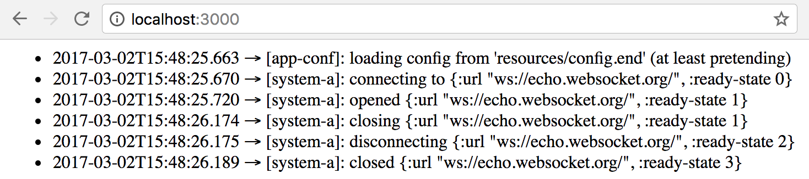

## Managing state in ClojureScript

- [The "Why"](#the-why)
- [Mount Modes](#mount-modes)
  - [Just Clojure Mode](#just-clojure-mode)
  - [Clojure and ClojureScript Mode](#clojure-and-clojurescript-mode)
- [Mounting that ClojureScript](#mounting-that-clojurescript)
  - [Using States](#using-states)
- [Thanks](#thanks)

In case you need to manage state in ClojureScript using mount, _all_ the mount Clojure features are supported in ClojureScript. 
Which means all the mount Clojure [documentation](../README.md) is the mount ClojureScript documentation.

With a slight change in [_mode_](clojurescript.md#mount-modes) ( no change in _mood_ though, just the _mode_ :)).

### The "Why"

Since [reader conditionals](http://clojure.org/reader#The%20Reader--Reader%20Conditionals) were added in Clojure 1.7,
it became a lot easier to target both platforms with lots of code reuse. You might have noticed 
that most of mount code lives in `.cljc` files.

The way mount is designed it "mounts" itself to a solid Clojure [namespace API](http://clojure.org/namespaces), 
and while `.cljc` helps a lot with targeting Clojure and ClojureScript, JavaScript VM is vastly different from JVM.
Since JavaScript mostly tagrets browsers, mobile devices and IoT, 
it is quite important to [compress](https://github.com/clojure/clojurescript/wiki/Advanced-Compilation) the final result.

Which means that Clojure namespaces API are not that well supported in ClojureScript, since they get renamed and optimized
during compilation + of course no native namespace support on the JavaScript side 
(but that is somewhat solved with [Google Closure](https://closure-library.googlecode.com/git-history/docs/local_closure_goog_base.js.source.html#line428)).

But. When developing an application in Clojure and ClojureScript, it would only make sense if the API for any library 
would be _identical_ for both platforms. It should be transparent for developers whether they use a library in Clojure or ClojureScript.
It is not possible for all libraries (i.e. concurrency, reified Vars, etc.), but we should try to make it possible for most.

### Mount Modes

Mount has two modes `clj` and `cljc`.

#### Just Clojure Mode

`clj` mode is _default_, and all the APIs are exactly the same as they are in the mount Clojure [documentation](../README.md).

#### Clojure _and_ ClojureScript Mode

`cljc` mode is is not default, but it is easy to switch to:

To switch Mount into this mode do:

```clojure
(mount/in-cljc-mode)
```

anywhere before a call to `(mount/start)`, usually at the entry point of an app: in the `-main`, web handler, etc.

This sets mount into the `cljc` mode. In this mode mount supports _both_: Clojure and ClojureScript with one difference 
from the default `clj` mode:

> all states are "_derefable_"

which means in order to use them, you'd need to `@` it. That's where the difference between the two modes ends.

Again, `cljc` mode API is _consistent across both_ Clojure and ClojureScript.

While initially it may sound strange, this approach has very nice properties:

* Mentally something that you deref (`@`) is associated with a state behind it
* The whole system may start lazily without an explicit call `(mount/start)`
* States may have watchers which is just an idea at this point, but it could be quite useful

No need to call `(mount/in-cljc-mode)` on ClojureScript side, it is only called once on the server (Clojure) side.

_note: `(mount/in-cljc-mode)` does not require the code to be `.cljc`, just a geeky name to convey the support for both modes: Clojure and ClojureScript_

Now that the theory is laid out...

### Mounting that ClojureScript

Let's look at the example [ClojureScript app](../dev/cljs/app) that uses mount to manage several states:

* [Datascript](https://github.com/tonsky/datascript) Database
* Websocket Connection
* Configuration

In order to run it, just compile `cljs` (in `:advanced` mode, because why not? :)) with:

```clojure
$ lein do clean, cljsbuild once prod
Compiling ClojureScript...
Compiling "dev/resources/public/js/compiled/mount.js" from ["src" "dev/cljs"]...
Successfully compiled "dev/resources/public/js/compiled/mount.js" in 23.966 seconds.
```

And just open a browser at `file:///[path-to-mount]/mount/dev/resources/public/index.html`:



The flow behind the app is quite simple:

* load config
* open a WebSocket connection
* keep an audit log in Datascript
* call `(mount/stop)` to disconnect

#### Using States

A good example of derefing state is here in [websockets.cljs](https://github.com/tolitius/mount/blob/0825ad2ed085b73b7ae989b4382ce4e0376e4be3/dev/cljs/app/websockets.cljs#L21):

```clojure

(ns app.websockets
  (:require [app.conf :refer [config]]
            [app.audit-log :refer [audit log]])
  (:require-macros [mount.core :refer [defstate]]))

;; ...

(defstate system-a :start (connect (get-in @config [:system-a :uri]))
                   :stop (disconnect system-a))
```

notice how config is deferef'ed `@config` in order to use its state. It of course does not have to be deref'ed here, and
can be just passed along to the `connect` function to be `@`ed there instead.

### Thanks

I'd like to thank these good people for brainstorming and supporting the idea of Mount in ClojureScript universe:

[@DomKM](https://github.com/DomKM), [@yogthos](https://github.com/yogthos) and [@edvorg](https://github.com/edvorg)
