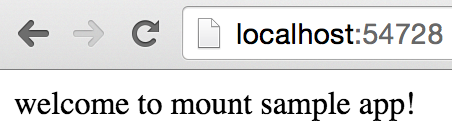
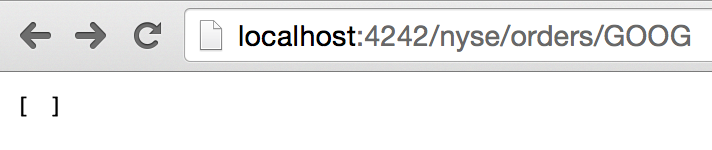
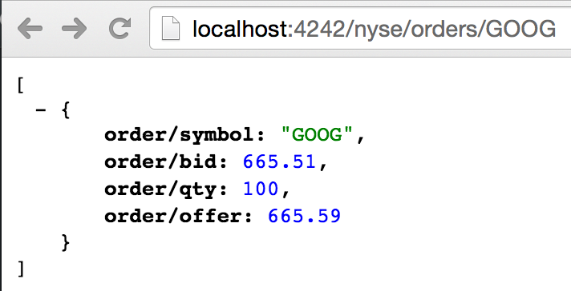

## Creating Reloadable Uberjar'able App

This example lives in the `uberjar` branch. If you'd like to follow along:

```bash
$ git checkout uberjar
Switched to branch 'uberjar'
```

### App state

Here is an example [app](https://github.com/tolitius/mount/tree/uberjar/test/app) that has these states:

```clojure
16:20:44.997 [nREPL-worker-0] INFO  mount - >> starting..  app-config
16:20:44.998 [nREPL-worker-0] INFO  mount - >> starting..  conn
16:20:45.393 [nREPL-worker-0] INFO  mount - >> starting..  nyse-app
16:20:45.443 [nREPL-worker-0] INFO  mount - >> starting..  nrepl
```

where `nyse-app` is _the_ app. It has the usual routes:

```clojure
(defroutes mount-example-routes

  (GET "/" [] "welcome to mount sample app!")
  (GET "/nyse/orders/:ticker" [ticker]
       (generate-string (find-orders ticker)))

  (POST "/nyse/orders" [ticker qty bid offer] 
        (add-order ticker (bigdec bid) (bigdec offer) (Integer/parseInt qty))
        (generate-string {:added {:ticker ticker 
                                  :qty qty 
                                  :bid bid 
                                  :offer offer}})))
```

and the reloadable state:

```clojure
(defn start-nyse []
  (create-nyse-schema)                      ;; creating schema (usually done long before the app is started..)
  (-> (routes mount-example-routes)
      (handler/site)
      (run-jetty {:join? false
                  :port (get-in app-config [:www :port])})))

(defstate nyse-app :start (start-nyse)
                   :stop (.stop nyse-app))  ;; it's a "org.eclipse.jetty.server.Server" at this point
```

In order not to block, and being reloadable, the Jetty server is started in the "`:join? false`" mode which starts the server, 
and just returns a reference to it, so it can be easily stopped by `(.stop server)`

### "Uberjar is the :main"

In order for a standalone jar to run, it needs an entry point. This sample app [has one](https://github.com/tolitius/mount/blob/uberjar/test/app/app.clj#L16):

```clojure
;; example of an app entry point
(defn -main [& args]
  (mount/start))
```

And some usual suspects from `project.clj`:

```clojure
;; "test" is in sources here to just "demo" the uberjar without poluting mount "src"
:uberjar {:source-paths ["test/app"]
          :main app
          :aot :all}})
```

### REPL time

```clojure
$ lein do clean, repl

user=> (dev)(reset)
16:20:44.997 [nREPL-worker-0] INFO  mount - >> starting..  app-config
16:20:44.998 [nREPL-worker-0] INFO  mount - >> starting..  conn
16:20:45.393 [nREPL-worker-0] INFO  mount - >> starting..  nyse-app

16:20:45.442 [nREPL-worker-0] INFO  o.e.jetty.server.AbstractConnector - Started SelectChannelConnector@0.0.0.0:4242

16:20:45.443 [nREPL-worker-0] INFO  mount - >> starting..  nrepl
:ready
dev=>
```

Jetty server is started and ready to roll. And everything is still reloadable:

```clojure
dev=> (reset)
19:06:31.649 [nREPL-worker-1] INFO  app.utils.logging - << stopping..  #'app/nrepl
19:06:31.650 [nREPL-worker-1] INFO  app.utils.logging - << stopping..  #'app.db/conn
19:06:31.652 [nREPL-worker-1] INFO  app.utils.logging - << stopping..  #'app.config/app-config

:reloading ()

19:06:31.681 [nREPL-worker-1] INFO  app.utils.logging - >> starting..  #'app.config/app-config
19:06:31.682 [nREPL-worker-1] INFO  app.utils.logging - >> starting..  #'app.db/conn
19:06:31.704 [nREPL-worker-1] INFO  app.utils.logging - >> starting..  #'app/nrepl
```

notice that a web server was not restarted. This is done by choice, not to get an occasional `java.net.BindException: Address already in use`. When restarting, we stopping everything, _but the web server_ in `dev.clj`:

```clojure
(defn stop []
  (mount/stop-except #'app.www/nyse-app))
```

here more documentation on [stopping an application except certain states](https://github.com/tolitius/mount#stop-an-application-except-certain-states).

### Packaging one super uber jar

```clojure
$ lein do clean, uberjar
...
Created /Users/tolitius/1/fun/mount/target/mount-0.1.5-SNAPSHOT-standalone.jar ;;  your version may vary
```

Let's give it a spin:

```bash
$ java -jar target/mount-0.1.5-SNAPSHOT-standalone.jar
...
16:51:35.586 [main] DEBUG o.e.j.u.component.AbstractLifeCycle - STARTED SelectChannelConnector@0.0.0.0:4242
```

Up and running on port `:4242`:

###### _(TODO: change images to reflect 4242 port)_



See if we have any orders:



we don't. let's put something into Datomic:

```clojure
$ curl -X POST -d "ticker=GOOG&qty=100&bid=665.51&offer=665.59" "http://localhost:4242/nyse/orders"
{"added":{"ticker":"GOOG","qty":"100","bid":"665.51","offer":"665.59"}}
```

now we should:



### Choices

There are multiple ways to start a web app. This above is the most straighforward one: start server / stop server.

But depending on the requirements / architecture, the app can also have an entry point to `(mount/start)` 
via something like [:ring :init](https://github.com/weavejester/lein-ring#general-options)). Or the `(mount/start)` 
can go into the handler function, etc.
